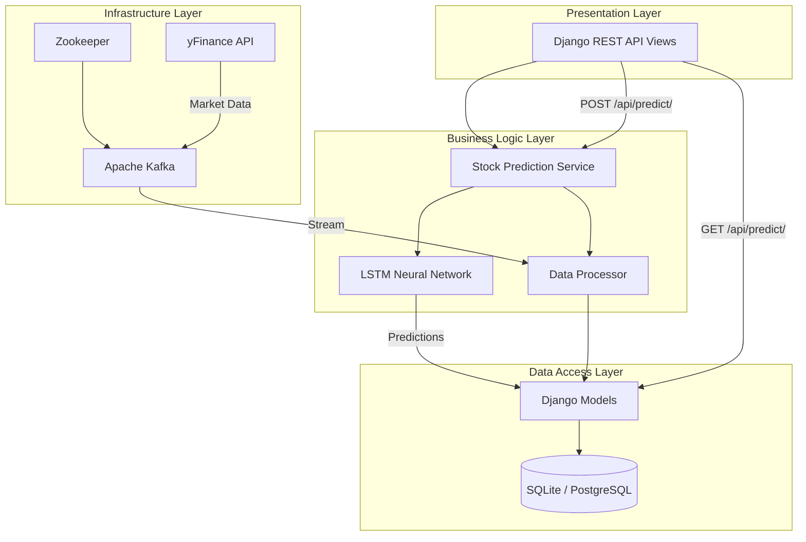
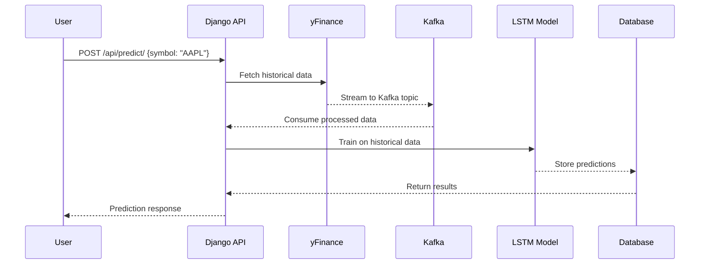

# Tradezy 📈🤖

[](https://github.com/krishnakumarbhat/Tradezy/actions/workflows/ci.yml)
[](https://python.org)
[](https://www.django-rest-framework.org/)

Tradezy is a **stock prediction system** built with Django, Apache Kafka, and LSTM neural networks. It follows clean architecture principles with distinct layers for real-time stock data streaming and future price prediction.

## 🏗️ Architecture



## 🔄 Data Flow



## 🛠️ Tech Stack

| Component    | Technology                    |
| ------------ | ----------------------------- |
| Backend      | Django + DRF                  |
| ML Model     | LSTM (PyTorch/TensorFlow)     |
| Streaming    | Apache Kafka                  |
| Data Source  | yFinance API                  |
| Database     | SQLite (default)              |
| Architecture | Clean Architecture (4 layers) |

## 🚀 Quick Start

### Prerequisites

- Python 3.8+
- Apache Kafka + Zookeeper

### Setup

```bash
# Clone the repo
git clone https://github.com/krishnakumarbhat/Tradezy.git
cd Tradezy/lstmstockkafka

# Install dependencies
pip install -r requirements.txt

# Start Zookeeper
bin/zookeeper-server-start.sh config/zookeeper.properties

# Start Kafka
bin/kafka-server-start.sh config/server.properties

# Run Django migrations
python manage.py makemigrations
python manage.py migrate

# Start the server
python manage.py runserver
```

## 🔌 API Endpoints

| Method | Endpoint                    | Description                                            |
| ------ | --------------------------- | ------------------------------------------------------ |
| POST   | `/api/predict/`             | Train LSTM model and get prediction for a stock symbol |
| GET    | `/api/predict/?symbol=AAPL` | Get historical predictions for a stock                 |

### Example Request

```bash
curl -X POST http://localhost:8000/api/predict/ \
  -H "Content-Type: application/json" \
  -d '{"symbol": "AAPL"}'
```

## 📁 Project Structure

```
Tradezy/
├── lstmstockkafka/
│   ├── stock_prediction/        # Django app for predictions
│   │   ├── models.py            # Stock & prediction models
│   │   ├── services.py          # LSTM prediction service
│   │   ├── views.py             # API views
│   │   └── urls.py              # URL routing
│   ├── stock_predictor/         # Django project settings
│   ├── deep_learning-main/      # DL reference materials
│   ├── stock-market-kafka-data-engineering-project-main/
│   │   └── ...                  # Kafka data pipeline
│   ├── manage.py
│   └── requirements.txt
├── .github/workflows/           # CI/CD pipeline
├── .gitignore
└── README.md
```

## 🏛️ Architecture Benefits

1. **Separation of Concerns** — Each layer has a specific responsibility
2. **Maintainability** — Easy to modify or replace components
3. **Testability** — Components can be tested in isolation
4. **Scalability** — Kafka enables horizontal scaling of data streams
5. **Flexibility** — Swap LSTM for Transformer or other models easily

## 📝 License

MIT License

## 🤝 Contributing

1. Fork the repository
2. Create a feature branch: `git checkout -b feature-name`
3. Commit your changes: `git commit -m 'Add feature'`
4. Push to the branch: `git push origin feature-name`
5. Open a pull request
